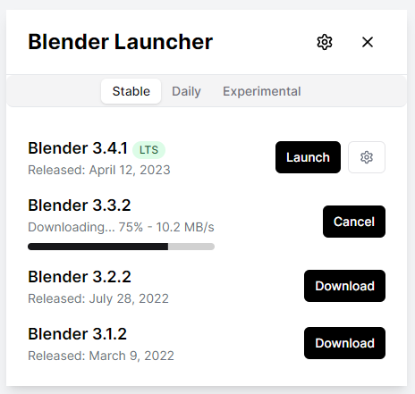

  

> **Note**: This project is currently under development and may not be fully functional. If you encounter any issues or have any suggestions, please feel free to open an issue or submit a pull request on the GitHub repository.

## Introduction

Blender Launcher is a user-friendly tool that streamlines the management of multiple Blender versions. It allows you to download different releases and integrates a convenient dialog, enabling you to choose which version to use when opening Blender files.

## Operating System Support

| Operating System | Current Support | Future Plans |
| ---------------- | --------------- | ------------ |
| Windows          | ✔️ Tested and Supported | - |
| Linux            | ❌ Not Yet Supported | Support is planned and will be added in the future |
| macOS            | ❌ Not Yet Supported | Support is contingent upon access to an Apple device for testing and debugging. If you are a macOS user and would like to assist in debugging on your device, your help would be greatly appreciated. Please reach out by opening an issue on the GitHub repository. |

## Contributing

Contributions to `blender-launcher` are welcome! Please open an issue or submit a pull request on the GitHub repository.

## License

`blender-launcher` is released under the [Unlicense](LICENSE.md). This means the code is in the public domain
